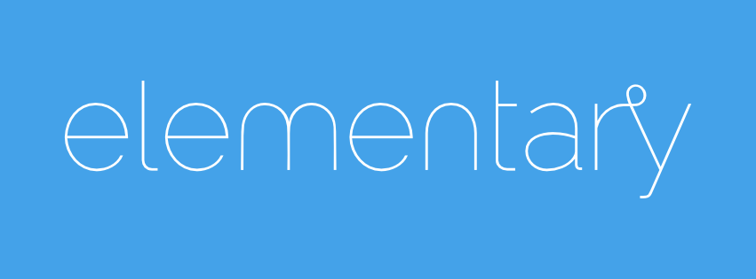

This is a copy of the Brand Page from our website. Please also check the [actual page](http://elementary.io/brand) for information, this copy is just informational.

# Brand
The elementary brand is unique: technically it belongs to elementary LLC., the company that guides and supports development of elementary products. However, we have a great community and don’t want to be too overbearing with legal requirements and technicalities. As such, we have written up some guidelines to make it easier to understand when and how the elementary brand should be used.

# Name
The word "elementary" refers to and is a trademark of elementary LLC. elementary is always lower-case, even when beginning sentences such as this. It is also used along with product names (i.e. "elementary OS") to refer to a specific product of elementary.

# Brand Marks

elementary owns two marks: the "elementary" logotype and the "e" logomark. Both are considered trademarks and represent elementary—the company—and its products.

Both should be used with the following in mind:

    Do not stretch, skew, rotate, flip, or otherwise alter the marks.
    Do not use the marks on an overly-busy background; solid colors work best.
    The marks should always be monochromatic; typically white if on a dark background, or black if on a light background.

## Logotype

The logotype is to be used when space allows to refer to elementary the company. It can be used before a product name to refer to a specific product of elementary.

The logotype should always be used under the following guidelines:

    Do not attempt to recreate the logotype. It is a meticulously-designed brand mark, not simply "elementary" written in a specific font.
    Do not use the logotype at small sizes; if it is not clear, use the logomark instead.

## Logomark

The "e" logomark is to be used to refer to elementary the company when space is constrained or a square ratio is required.
Color

elementary employs the use of color combined with our name and marks to establish our brand. We use the following palette:

Blueberry
    3892e0

Strawberry
    da4d45

Orange
    f37329

Banana
    fbd25d

Lime
    93d844

Grape
    8a4ebf

White
    ffffff

Black
    333333

# Fonts

For web and print, we use Raleway for headings and Open Sans for body copy. For code blocks, we use Roboto Mono.
Third Parties

We encourage third party developers creating products for elementary OS to adopt certain elements of the elementary brand to achieve consistency:

    Color
    Fonts
    Voice/tone

However, to avoid user confusion, we do restrict the usage of the elementary name and marks:

    You are encouraged to say that your app or service is designed for elementary OS, but please don't use the elementary name or marks as part of the name of your company, application, product, service, or in any logo you create.
    Only use the elementary name or marks to refer to elementary LLC. or its products (i.e. elementary OS).

# Merchandise

We do not typically allow our branding (including our name or brand marks) to be used on third-party merchandise.

# Assets & More Info
This Github repository is full of Assets you can use.
For further information regarding the use of the elementary name, branding, and trademarks, please email brand@elementary.io.
